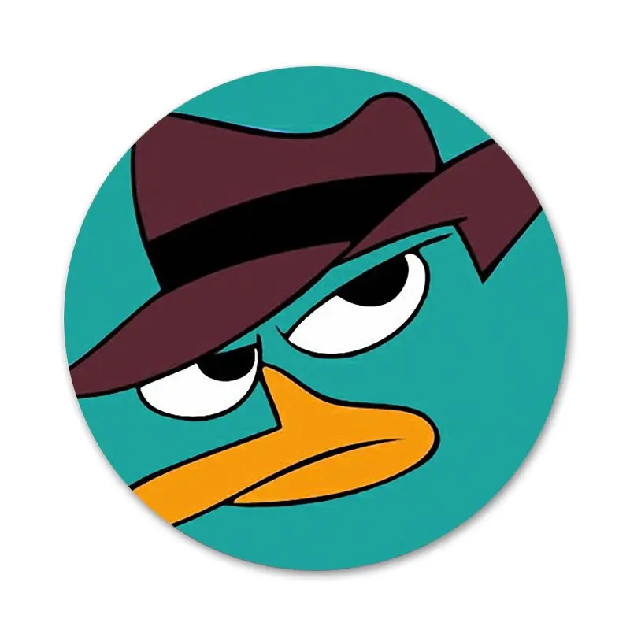

C P E R R Y M A P S
========

#### Student at Appalachian State University

#### Boone, North Carolina, USA

Expertise
-----
Environmental conservation, environmental biology, invasive plant management

Education
-----
Major: Biology 
Concentration: Ecology, Evolution, and Environmental Biology
Certificate: Geographic Information Systems

Professional Experience
----
####**Sugar Mountain Resort**
- Manager
    - Banner Elk NC 
        - *November 2023 - Present*

####**Kenai Fjords National Park**
- Intern
    - Seward AK 
        - *May 2023 - August 2023*

####**Behavioral Ecology Research Lab**
- Research Assistant
    - Appalachian State University, Boone NC
        - *December 2021 - Present*

[Portfolio](https://www.appstate.edu/)

